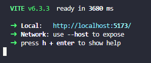

# 🤖 FURIA chat em tempo real

Este projeto é uma simulação de **chat em tempo real** com integração de **eventos automáticos via bot** de acontecimentos In-Game do time da **FURIA** em seus jogos. Idealizado para fãs da equipe de eSports **FURIA**, ele faz uma simulação de chat em que fãs possam trocar mensagens e que, também, recebam atualizações simuladas de partidas através de eventos automáticos enviados por um bot.


## 📁 Estrutura do Projeto
furia/ 
<br>├── backend/ # Node.js + Express + MongoDB + Socket.IO 
<br>├── frontend/ # React + TailwindCSS + Socket.IO Client

### ✅ Frontend (React)
- Interface moderna com animações (GSAP + Tailwind)
- Scroll automático até a última mensagem
- Exibição diferenciada para mensagens do bot
- Envio de mensagens em tempo real via Socket.IO

### ✅ Backend (Node.js + Express)
- Integração com MongoDB via Mongoose
- Emissão de eventos automáticos com mensagens de bot
- Histórico de mensagens (rota REST `/messages`)
- Suporte a WebSocket com configuração CORS adequada


## ⚙️ Tecnologias Utilizadas

### 🖥️ Frontend
- Vite
- React
- Tailwind CSS
- GSAP (animações)
- Socket.IO Client
- Font Awesome

### 🧠 Backend
- Node.js
- Express
- MongoDB + Mongoose
- Socket.IO
- CORS
- Dotenv

## 🔧 Como Rodar o Projeto

Instale em seu computador o NodeJS para rodar o gerenciador de pacotes `npm`!<br><br>

Inicialmente, em nosso projeto, devemos instalar todas as dependências! Tanto no front-end quanto no back-end, escrevendo o comando: <br>
`npm i` ou `npm install`. 
<br><br>Caso queira instalar as dependências do back-end, basta trocar a pasta, em seu terminal, da seguinte forma: `cd backend` e em seguida `npm i` pronto dependências instaladas.

Para rodar o front-end, feito em ReactJS, basta apenas escrever este comando na pasta raiz do projeto: <br>
```npm run dev``` 
<br><br>Isso fará com que o projeto seja rodado, aparecendo desta forma em seu terminal: 
<br>

<br><br>
Para rodar o backend temos duas opções que terão o mesmo resultado:<br>
- Opção 1: `npm start`
- Opção 2: `node server.js`
<br>
## 🌐 Comunicação entre Frontend e Backend
- O frontend se conecta ao backend via Socket.IO e consome a API REST em /messages.
- O backend emite mensagens de bot a cada 8 segundos simulando eventos como kills, plant de C4, pausas, etc.
